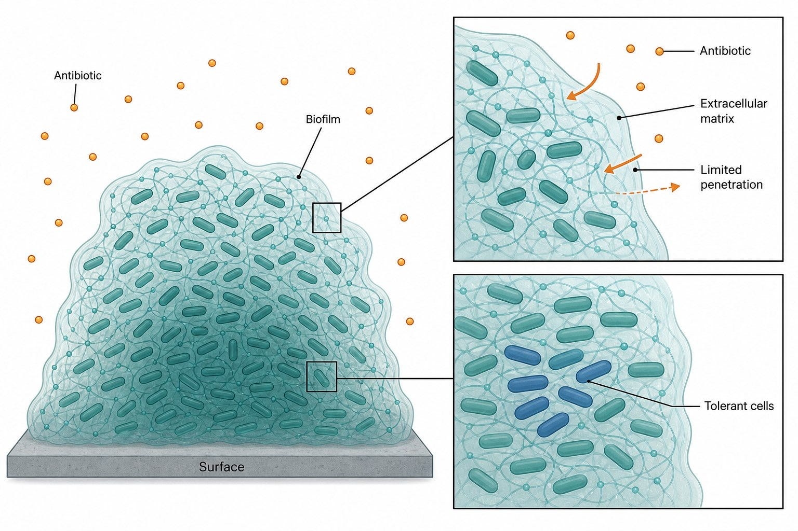
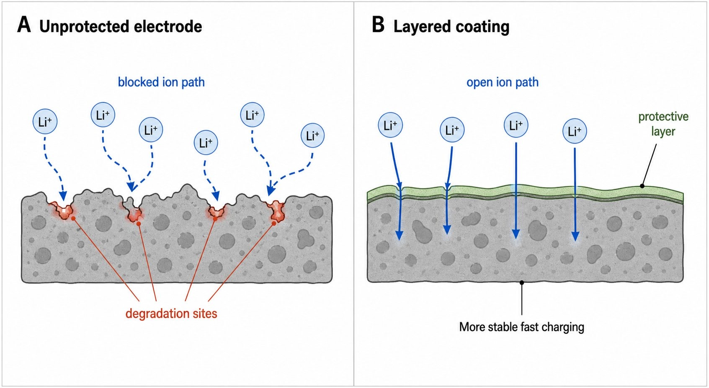

# Science Illustration Skill

Create scientific illustrations for your research papers using this skill.

This Codex skill helps researchers, product managers, founders, and technical writers create publication-style scientific schematics without starting from a blank prompt. It is designed for research paper figures, concept diagrams, mechanism explainers, graphical abstracts, workflow figures, and comparison panels.

It is not a fake-data generator. The skill avoids invented plots, microscopy, spectra, gel bands, molecular structures, p-values, readouts, and other evidence-like visuals unless you provide the source material.

## Example Style

Use the skill when you want clear scientific visuals like these:

| Mechanism with zoom panels | Before / after comparison |
| --- | --- |
|  |  |

The target look is restrained and journal-ready: white background, clear labels, thin schematic linework, limited colors, and one core idea per figure.

## Why PMs Should Try It

Product teams often need scientific visuals before they have a designer, illustrator, or finalized paper figure. This skill is useful for:

- explaining a product mechanism in a pitch deck
- turning a dense scientific workflow into one simple image
- sketching figure directions for a designer or scientist
- exploring graphical abstract options
- making technical blog posts easier to understand
- aligning a team around what a complex process actually means

## What It Creates

- Mechanism schematics
- Experimental workflows
- Assay pipelines
- Graphical abstracts
- Conceptual science diagrams
- Comparison panels
- Model architecture schematics
- Shot lists for figures

## What It Refuses To Invent

- fake charts, axes, or quantitative results
- fake microscopy, gel bands, spectra, or readouts
- unsupported molecular, anatomical, or clinical detail
- named pathways, variables, materials, instruments, or outcomes not supplied by you

## Quick Start

Ask Codex for a scientific figure and include:

1. the topic
2. the audience
3. the exact labels you want shown
4. the figure type, if you know it
5. anything that must not be implied

Example:

```text
Use the science illustration skill to create a 2-panel schematic showing how a protective coating keeps lithium ion paths open during fast charging.

Labels: unprotected electrode, layered coating, blocked ion path, open ion path, degradation sites, protective layer.

Do not invent performance numbers, timepoints, chemistry details, or measurements.
```

## Prompt Template

```text
Create a clean publication-style scientific schematic of [topic].

Audience: [PMs / scientists / investors / product users].
Goal: explain [one core idea].
Figure type: [mechanism / workflow / comparison / graphical abstract].
Required labels: [label 1], [label 2], [label 3].
Must avoid: fake data, unsupported mechanisms, invented measurements, or extra labels.
Style: white background, restrained palette, thin linework, Helvetica labels, clear arrows, one core idea.
```

## Installation

Place this folder in your Codex skills directory:

```bash
~/.codex/skills/science-illustration-skill
```

Then restart Codex so the skill index refreshes.

## Repository Shape

```text
SKILL.md                         skill entrypoint
references/style-dna.md          visual style rules
references/figure-types.md       figure structure guidance
references/scientific-integrity.md
references/prompt-template.md
references/qa-checklist.md
docs/images/                     README reference images
```

## Design Defaults

- White or transparent-looking background
- Helvetica labels by default
- Blue/teal for primary structures
- Orange for flow or intervention
- Red/magenta for damage or failure
- Green for activation or improvement
- Short labels, usually 1-4 words
- One figure explains one idea

## Best Use

Start with a rough prompt. Let the skill produce one clear figure. Then iterate on labels, panel count, and scientific boundaries.

For product work, the fastest path is usually:

1. generate one mechanism schematic
2. ask for a cleaner version with fewer labels
3. ask for a designer handoff shot list
4. use the final image as a direction-setting reference
