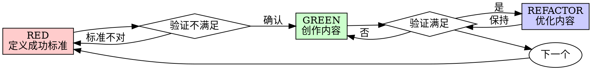

# 超能力 (Superpowers) for OpenClaw

**版本**: 2.0.0  
**创建日期**: 2026-03-22  
**定位**: 通用创作工作流（Skill 创作、文档撰写、方案设计等）

---

## 🎯 概述

Superpowers 是一套完整的创意工作流，专为 OpenClaw 技能创作和通用创意项目设计。它不是直接跳入写作，而是在创作之前先理解需求、创建设计文档、制定详细计划，然后通过系统化的方式逐步实现。

**核心理念**：
- **测试驱动创作 (TDC)** - 先定义成功标准，验证不满足，再创作内容，验证满足
- **系统化而非临时** - 流程优于猜测
- **简洁性优先** - 只创作必要内容
- **证据优于声明** - 验证后再宣布完成

**适用场景**：
- ✅ 创建新的 OpenClaw Skill
- ✅ 撰写技术文档/教程
- ✅ 设计工作方案/流程
- ✅ 创作结构化内容（如小红书文案、文章系列）
- ✅ 任何需要设计和计划的创意项目

---

## 📋 核心技能库

### 设计阶段

| 技能 | 触发时机 | 说明 |
|------|----------|------|
| **brainstorming** | 任何创意工作之前 | 通过问答澄清需求，提出 2-3 种方案，呈现设计并获得批准 |
| **setup-workspace** | 设计批准后 | 创建项目工作区（目录结构、配置文件、模板等） |

### 计划阶段

| 技能 | 触发时机 | 说明 |
|------|----------|------|
| **writing-plans** | 有设计文档后，创作前 | 将工作分解为 2-5 分钟的小任务，每个任务包含精确文件、内容要点、验证步骤 |

### 执行阶段

| 技能 | 触发时机 | 说明 |
|------|----------|------|
| **subagent-driven-creation** | 有计划后（推荐） | 为每个任务分派新鲜子代理，两阶段审查（规范合规性 + 内容质量） |
| **executing-plans** | 有计划后（备选） | 批量执行任务，带有人类检查点 |
| **test-driven-creation** | 创作过程中 | 强制执行 RED-GREEN-REFACTOR 循环（针对内容创作） |

### 质量保障

| 技能 | 触发时机 | 说明 |
|------|----------|------|
| **content-review** | 任务之间 | 根据计划审查内容，按严重程度报告问题 |
| **verification-before-completion** | 完成前 | 确保内容真正满足需求，而非"看起来完成了" |
| **finishing-project** | 项目完成后 | 最终验证，整理归档，提供发布/交付选项 |

### 元技能

| 技能 | 触发时机 | 说明 |
|------|----------|------|
| **writing-skills** | 需要创建新技能时 | 按照最佳实践创建新的 OpenClaw Skill |
| **using-superpowers** | 首次使用 | Superpowers 技能系统介绍 |

---

## 🔄 基本工作流

```
┌─────────┐     ┌─────────────┐     ┌─────────────┐
│  开始   │ ──→ │ brainstorming│ ──→ │setup-workspace│
└─────────┘     │  澄清需求    │     │  创建工作区   │
                └─────────────┘     └─────────────┘
                                          ↓
┌─────────┐     ┌─────────────┐     ┌─────────────┐
│  完成   │ ←── │finishing-project│ ←─ │test-driven-creation│
└─────────┘     │  验证归档    │     │  创作 + 验证   │
                └─────────────┘     └─────────────┘
                                          ↑
                ┌─────────────┐     ┌─────────────┐
                │writing-plans│ ←── │subagent-driven│
                │  制定计划    │     │  子代理执行   │
                └─────────────┘     └─────────────┘
```

### 详细流程

1. **brainstorming** - 在任何创作之前激活。通过问答澄清需求，探索替代方案，分章节呈现设计以获得批准。保存设计文档到 `docs/superpowers/specs/`。

2. **setup-workspace** - 设计批准后激活。创建项目目录结构、配置文件、模板等。

3. **writing-plans** - 与批准的设计一起激活。将工作分解为小任务（每个 2-5 分钟）。每个任务都有精确的文件路径、内容要点、验证步骤。

4. **subagent-driven-creation** - 与计划一起激活。为每个任务分派新鲜子代理，进行两阶段审查（规范合规性，然后内容质量）。

5. **test-driven-creation** - 创作过程中激活。强制执行 RED-GREEN-REFACTOR：定义成功标准→验证不满足→创作内容→验证满足→优化。

6. **content-review** - 任务之间激活。根据计划审查内容，按严重程度报告问题。关键问题阻止进度。

7. **finishing-project** - 项目完成后激活。最终验证，整理归档，提供发布/交付选项。

---

## 🚀 使用方法

### 触发方式

Superpowers 技能是**自动触发**的。当检测到特定场景时，会自动调用相应技能：

| 场景 | 自动触发的技能 |
|------|---------------|
| "帮我设计一个技能" | brainstorming |
| "帮我规划这个文档" | brainstorming → writing-plans |
| "创建一个新的 skill" | brainstorming → setup-workspace → writing-plans → subagent-driven-creation |
| "测试这个技能是否有效" | test-driven-creation |
| "审查这个文档" | content-review |

### 手动调用

也可以通过明确指令触发：

```
请使用 brainstorming 技能来设计这个技能
```

```
请使用 writing-plans 技能创建创作计划
```

```
请使用 test-driven-creation 来确保内容质量
```

---

## 📁 文件结构

```
superpowers/
├── SKILL.md                    # 此文档
├── scripts/
│   ├── todo.sh                 # 任务管理脚本
│   ├── testing-guide.md        # 测试驱动创作指南
│   └── content-anti-patterns.md # 内容创作反模式
└── prompts/
    ├── creator-prompt.md              # 创作者子代理提示
    ├── spec-compliance-reviewer-prompt.md # 规范合规性审查者提示
    ├── content-quality-reviewer-prompt.md # 内容质量审查者提示
    └── plan-reviewer-prompt.md        # 计划审查者提示
```

---

## 🎓 核心原则

### 测试驱动创作 (TDC - Test-Driven Creation)

**铁律**：没有定义成功标准就不开始创作

```
RED → GREEN → REFACTOR
```

1. **RED** - 定义成功标准（测试），验证当前内容不满足
2. **Verify RED** - 确认测试失败（内容确实不满足需求）
3. **GREEN** - 创作最小内容让测试通过
4. **Verify GREEN** - 确认内容满足需求且质量合格
5. **REFACTOR** - 优化内容，保持质量
6. **Repeat** - 下一个内容模块

**针对 Skill 创作的测试示例**：

| 测试类型 | 测试内容 | 如何验证 |
|----------|----------|----------|
| 功能测试 | Skill 命令是否可执行 | 运行命令，检查输出 |
| 文档测试 | SKILL.md 是否清晰 | 新用户能否独立使用 |
| 模板测试 | 模板是否可用 | 填充模板，检查输出 |
| 提示词测试 | AI 提示词是否有效 | 调用 AI，检查生成质量 |

**常见借口与现实**：

| 借口 | 现实 |
|------|------|
| "太简单了不需要测试" | 简单内容也会出问题。测试只需 30 秒。 |
| "我之后再测试" | 测试立即通过证明不了什么。 |
| "已经人工检查过了" | 临时检查 ≠ 系统测试。没有记录，无法重跑。 |
| "删除 X 小时工作是浪费" | 沉没成本谬误。保持不可信的内容才是技术债务。 |

### 系统化调试

**4 阶段根因分析**：

1. **复现** - 可靠地复现问题
2. **定位** - 缩小问题范围
3. **根因** - 找到根本原因
4. **修复** - 修复并验证

### YAGNI (You Aren't Gonna Need It)

** ruthlessly 移除不必要的内容**。只创作当前需要的，不为未来可能的需求添加复杂度。

### DRY (Don't Repeat Yourself)

**消除重复**。重复的内容是维护负担和错误来源。

---

## 📊 技能详细文档

### brainstorming

**何时使用**：任何创意工作之前 - 创建技能、撰写文档、设计方案、规划内容系列。

**硬性门槛**：
> 在呈现设计并获得用户批准之前，**禁止**开始任何创作行动。这适用于**每个**项目，无论感知多么简单。

**流程**：
1. 探索项目上下文 - 检查现有文件、文档、相关技能
2. 提供视觉伴侣（如果涉及视觉问题）- 这是独立消息
3. 问澄清问题 - 一次一个，理解目的/约束/成功标准
4. 提出 2-3 种方案 - 带权衡和你的推荐
5. 呈现设计 - 分章节，每章后获得批准
6. 写设计文档 - 保存到 `docs/superpowers/specs/YYYY-MM-DD-<topic>-design.md`
7. 规范审查循环 - 分派审查子代理，修复问题直到批准（最多 3 次迭代）
8. 用户审查书面规范 - 在继续前请求用户审查
9. 过渡到实现 - 调用 writing-plans 技能

**反模式**："这太简单了不需要设计"
> 每个项目都经过这个流程。单页文档、简单脚本、配置更改——都是。"简单"项目是未经审视的假设导致最多浪费工作的地方。设计可以很短（真正简单的项目几句话），但你**必须**呈现它并获得批准。

### writing-plans

**何时使用**：有计划或规范的多步骤任务，在开始创作之前。

**计划文档头部**（每个计划必须以此开头）：

```markdown
# [项目名称] 创作计划

> **对于 AI 工作者**：必需子技能：使用 superpowers:subagent-driven-creation（推荐）或 superpowers:executing-plans 来逐任务实现此计划。步骤使用复选框 (`- [ ]`) 语法进行跟踪。

**目标**：[一句话描述这个创作什么]

**方法**：[2-3 句关于方法的描述]

**产出物**：[关键文件/内容列表]

---
```

**任务结构**：

```markdown
### 任务 N: [内容模块名称]

**文件**：
- 创建：`exact/path/to/file.md`
- 修改：`exact/path/to/existing.md`（如需修改）
- 测试：`scripts/test-xxx.sh`（测试脚本）

- [ ] **步骤 1: 定义成功标准**

描述：什么情况下这个任务算完成？
示例：SKILL.md 包含所有必需字段，命令可执行，输出符合预期

- [ ] **步骤 2: 验证当前不满足**

运行：[验证命令或检查清单]
预期：不满足（因为还没创作）

- [ ] **步骤 3: 创作最小内容**

内容要点：[要创作的核心内容]

- [ ] **步骤 4: 验证满足**

运行：[验证命令或检查清单]
预期：满足所有成功标准

- [ ] **步骤 5: 优化内容**

检查：简洁性、清晰度、一致性

- [ ] **步骤 6: 归档**

保存文件，记录完成状态
```

**计划审查循环**：
1. 分派 plan-document-reviewer 子代理
2. 如果发现问题：修复，重新分派审查
3. 如果批准：进入执行交接

**执行交接**：
> "计划完成并保存到 `docs/superpowers/plans/<filename>.md`。两个执行选项：
> 
> **1. 子代理驱动（推荐）** - 我为每个任务分派新鲜子代理，任务间审查，快速迭代
> 
> **2. 内联执行** - 在此会话中使用 executing-plans 执行任务，批量执行带检查点
> 
> 哪种方式？"

### subagent-driven-creation

**何时使用**：在当前会话中执行包含独立任务的创作计划。

**核心原则**：每个任务新鲜子代理 + 两阶段审查（先规范后质量）= 高质量，快速迭代

**流程**：
1. 读取计划，提取所有任务及完整文本，注意上下文，创建 TodoWrite
2. 对每个任务：
   - 分派创作者子代理（带完整任务文本 + 上下文）
   - 创作者提问？回答并提供上下文
   - 创作者创作、自审
   - 分派规范合规性审查者
   - 规范审查通过？不通过则创作者修复，重新审查
   - 分派内容质量审查者
   - 质量审查通过？不通过则创作者修复，重新审查
   - 标记任务完成
3. 所有任务完成后，分派最终内容审查者
4. 使用 finishing-project

**模型选择**：
- **机械创作任务**（模板填充、格式转换、简单文档）：使用快速、便宜模型
- **判断和创意任务**（设计决策、内容创作、风格把握）：使用标准模型
- **审查和架构任务**：使用最强能力模型

**创作者状态处理**：
- **DONE**：进入规范合规性审查
- **DONE_WITH_CONCERNS**：完成工作但有疑虑。阅读疑虑，在审查前解决
- **NEEDS_CONTEXT**：需要未提供的信息。提供缺失上下文并重新分派
- **BLOCKED**：无法完成任务。评估阻碍：上下文问题提供更多上下文；需要更多推理用更强模型；任务太大拆分成小块；计划错误则上报人类

**禁止行为**：
- 未经用户明确同意开始创作
- 跳过审查（规范合规性或内容质量）
- 带着未修复的问题继续
- 并行分派多个创作者子代理（可能冲突）
- 让子代理读取计划文件（提供完整文本）
- 跳过场景设定上下文
- 忽略子代理问题
- 接受"差不多"的规范合规性
- 跳过审查循环
- 让自审替代实际审查
- **在规范合规性通过前开始内容质量审查**（顺序错误）
- 在任一审查有未决问题时进入下一任务

### test-driven-creation

**何时使用**：创作任何需要验证质量的内容时。

**RED-GREEN-REFACTOR 循环**：



**针对 Skill 创作的测试清单**：

| 阶段 | 测试项 | 验证方法 |
|------|--------|----------|
| 结构 | SKILL.md 有 name 和 description | 检查文件头部 |
| 功能 | 命令可执行 | 运行 `./script.sh --help` |
| 文档 | 使用方法清晰 | 新用户能否独立使用 |
| 模板 | 模板可填充 | 用示例数据测试 |
| 提示词 | AI 生成质量合格 | 调用 AI，人工审查输出 |
| 集成 | 与 OpenClaw 集成正常 | 在 OpenClaw 中调用 |

**内容质量检查清单**：

- [ ] 简洁 - 没有冗余内容
- [ ] 清晰 - 读者能理解
- [ ] 一致 - 术语、格式统一
- [ ] 完整 - 覆盖必要内容
- [ ] 准确 - 信息正确无误
- [ ] 可用 - 读者能按说明操作

---

## 🛠️ 辅助脚本

### todo.sh - 任务管理

```bash
# 创建任务
./todo.sh add "创建 SKILL.md 文档"

# 列出任务
./todo.sh list

# 标记完成
./todo.sh done 1

# 查看进度
./todo.sh status
```

### 测试指南

详见 `scripts/testing-guide.md`，包含：
- Skill 功能测试方法
- 文档质量检查清单
- AI 提示词测试技巧
- 模板验证方法

---

## 📚 参考文档

### 内容创作反模式

当创作文档或技能时，避免这些常见错误：
- 写完后不测试
- 假设读者有背景知识
- 缺少示例和截图
- 术语不一致
- 没有版本记录

### 调试技术

- **根因追踪** - 从症状追溯到根本原因
- **纵深防御** - 多层验证和错误处理
- **条件等待** - 正确处理异步和依赖

---

## ⚠️ 注意事项

1. **纪律**：Superpowers 是强制性工作流，不是建议。跳过步骤会导致低质量工作。
2. **耐心**：前期设计和计划看起来慢，但避免后期返工。
3. **信任流程**：即使"简单"任务也走完整流程。
4. **上下文管理**：子代理需要精确的上下文，不要让他们继承会话历史。
5. **审查循环**：发现问题→修复→重新审查，直到批准。不要跳过重新审查。
6. **测试驱动**：先定义成功标准，再创作内容。不要反过来。

---

## 📝 更新日志

### v2.0.0 (2026-03-22)
- ✅ 重构为通用创作工作流
- ✅ 移除 git 相关功能
- ✅ 移除代码审查功能
- ✅ TDD 改为测试驱动创作 (TDC)
- ✅ 强调 Skill 创作场景
- ✅ 新增内容质量检查清单

### v1.0.0 (2026-03-22)
- ✅ 从 https://github.com/obra/superpowers 完整迁移
- ✅ 适配 OpenClaw skill 格式

---

## 🔗 资源

- **原始项目**: https://github.com/obra/superpowers
- **博客文章**: [Superpowers for Claude Code](https://blog.fsck.com/2025/10/09/superpowers/)

---

**许可**: MIT License
