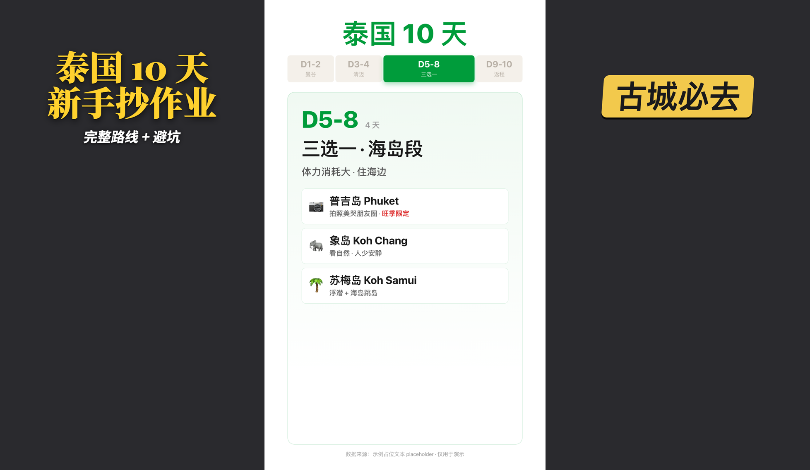
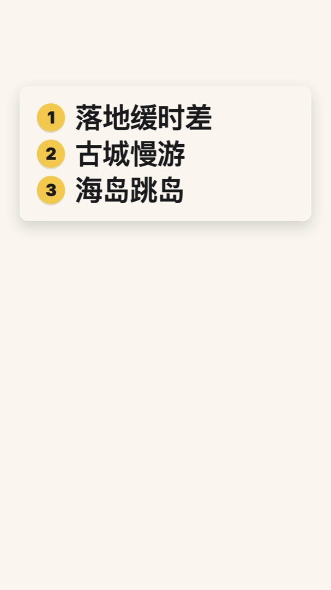
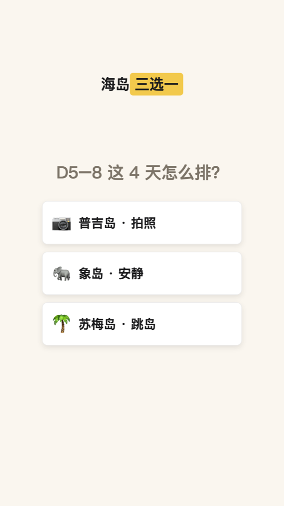
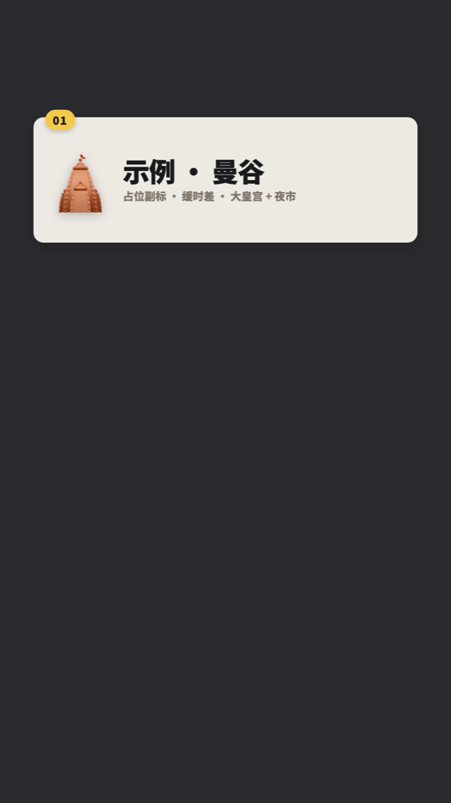
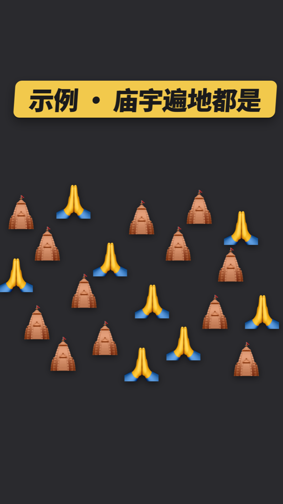

# video-editor · 9:16 口播视频合成 / 标题卡 / 动效 / 字幕


> 🌏 **English version: [README.en.md](./README.en.md)**

一个适配 Claude Code / Codex 等 Agent 环境的短视频合成技能。给它一条 9:16 竖屏口播录像，它帮你**烧标题卡片头、加动效叠层、烧关键词高亮字幕**，输出一条可直接发布的 `_整片.mp4`，以及（可选）给剪辑软件用的透明通道 `_broll层.mov`。

内置三个子模块，按需调用、不强制走全流程：

- **opener · 标题卡**：4.5s 动态黄字衬线标题卡（大标题 + 副标题），透明叠在口播上。
- **animator · 动效**：弹出关键词、全屏数据卡、编号列举、多段轮播等 7 个 HTML 模板，走「三道门」评审流程，结构性错误在 0 渲染阶段就抓住。
- **subtitle · 字幕**：whisper 自动转写 → 关键词黄色高亮 → PNG overlay 烧进画面。

> 由一线内容创作者在真实出海 / AI 科普系列短视频中沉淀而成，踩过的每一个坑都写进了 `recipes/PITFALLS.md`（22 条最贵的教训）。



<sub>↑ 三个子模块的渲染输出（占位演示文案「泰国 10 天」，非真实内容）：左 = opener 黄字标题卡，中 = animator 全屏行程数据卡，右 = chyron 关键词黄胶囊弹出。</sub>

## 30 秒开始

把下面这段话直接发给有 shell 权限的 AI Agent（Claude Code / Codex / Cursor），它会自动装好：

```text
帮我安装 video-editor 这个 Agent Skill。请把
https://github.com/lainshao/video-editor 克隆到我的 skills 目录
（Claude Code 用 ~/.claude/skills/video-editor，Codex 用 ~/.agents/skills/video-editor），
装完检查 SKILL.md、opener/、animator/、subtitle/ 是否都在。
```

装好后，直接对 Agent 说：

```text
帮我剪一下这个视频。
帮我给这条口播加字幕。
帮我做个片头标题卡。
新一期出海系列，从口播出整片。
```

它会先问你「最后要做成什么样」，再派给对应子模块。

## 能做什么

- 🎬 **0s 标题卡片头**：黄字衬线标题卡，透明 alpha 叠在 talking head 上，不是独立黑屏镜头
- ✨ **7 个动效模板**：关键词黄胶囊弹出、全屏数据卡、编号 1–4 列举、多段顶部轮播、群体 emoji 冲击等
- 🔤 **关键词高亮字幕**：whisper 自动转写 + 拼写修正 + 重点词黄色高亮，PNG overlay 烧死进画面
- 🎞 **双输出**：`_整片.mp4`（H.264 含音频，直接发）+ 可选 `_broll层.mov`（ProRes 4444 透明通道，进 Premiere / AE / FCP 叠层）
- 🚪 **三道门评审**：方案 → HTML 预览 → 渲前确认，把 fact-check / 样式 / 位置错误挡在渲染前，省渲染时间和 token
- 🎨 **Hana 视觉系统**：米色底 + 黄色记号笔强调 + 墨色字，可整体换肤
- 📐 **安全区内置**：顶部 10% / 底部 15% 留空，避开刘海和各平台 UI（抖音/小红书/视频号/Reels/Shorts）

## 动效模板一览

7 个内置模板，对应口播里不同的视觉时刻。下面是每个模板填入占位文案（泰国 10 天旅行示例）后的渲染缩略图——浏览器打开仓库里的 `gallery.html` 可看 live 动画。

<table>
<tr>
<td align="center" width="25%"><br><b>opener · 标题卡</b><br><sub>黄字衬线大标题 + 副标题<br>0s 透明叠层片头</sub></td>
<td align="center" width="25%"><br><b>chyron · 关键词胶囊</b><br><sub>黄底黑字 pop<br>1–2s 重点词强调</sub></td>
<td align="center" width="25%"><br><b>chyron_underline · 编辑下划线</b><br><sub>cream 卡黑字 + 黄下划线 wipe<br>术语 / 强调点</sub></td>
<td align="center" width="25%"><br><b>scene_listicle · 编号列举</b><br><sub>≤4 项 stagger reveal<br>「1、2、3」枚举语气</sub></td>
</tr>
<tr>
<td align="center" width="25%"><br><b>scene_blank · 全屏数据卡</b><br><sub>不透明 cutaway<br>caption + 自定义视觉</sub></td>
<td align="center" width="25%"><br><b>scene_progressive_top_card · 渐进轮播</b><br><sub>5+ 项顶部单卡轮播<br>末尾全屏 recap</sub></td>
<td align="center" width="25%"><br><b>scene_burst_emoji · emoji 冲击</b><br><sub>群体 emoji 涌现 + 黄胶囊<br>表达密度 / 数量感</sub></td>
<td width="25%"></td>
</tr>
</table>

<sub>透明叠层（opener / chyron / 下划线 / emoji）这里垫了中性深灰底方便预览，实际渲染是带 alpha 的透明通道，叠在 talking head 上。</sub>

## 适合 / 不适合

**✅ 合适**：9:16 竖屏口播 talking-head 视频 / 出海 / 知识科普 / 泛文化叙事 / 需要标题卡和动效字幕的短视频

**❌ 不合适**：16:9 横屏（v2 路线图）/ 纯语音生成 / 实拍 stock 素材抓取 / 低于 30s 的碎素材

## 常见使用场景

| 你想做的 | 推荐方式 |
|------|---------|
| 已有成片，只缺字幕 | 说「加字幕」→ subtitle 子模块，不走三道门 |
| 只要一个片头标题卡 | 说「做个片头」→ opener 子模块 |
| 给整片加弹出关键词 / 数据卡 | 说「在 X 秒加个 chyron / 切个数据卡」→ animator |
| 一条裸口播从头做成整片 | 说「新一期 X 系列」→ 全流程走三道门 |
| 发现 fact-check 错了要重做 | 走 animator 三道门，门 1 改方案最便宜 |

## 平台支持

| 平台 | 状态 | 说明 |
|------|------|------|
| Claude Code | 支持 | 原生 Skill，路由那步用 `AskUserQuestion` 可点击菜单 |
| Codex | 支持 | 同一套 `SKILL.md` 格式，路由降级为纯文字提问，功能不变 |
| Cursor / 其他本地 Agent | 可用 | 需要能读写文件 + 执行 shell（ffmpeg / node / python） |
| 普通 Chatbot | 不推荐 | 没有文件系统和渲染环境，跑不起来 |

## 安装

### 方式一：把这段话发给 AI（推荐，零门槛）

见上面「30 秒开始」，复制那段话给任意有 shell 权限的 Agent 即可。

### 方式二：手动命令行

```bash
# Claude Code
git clone https://github.com/lainshao/video-editor.git ~/.claude/skills/video-editor

# OpenAI Codex
git clone https://github.com/lainshao/video-editor.git ~/.agents/skills/video-editor
```

装完重启 Agent（或开新会话）让它识别这个 skill。

### 依赖

**装完先跑 `bash recipes/doctor.sh` 自检**，一眼看缺啥。手动装清单：

```bash
brew install ffmpeg            # 合成 + 烧字幕
brew install whisper-cpp       # 转写（命令是 whisper-cli）
brew install node              # HyperFrames / timecut 渲染（Node ≥ 22 即可，v25 已实测）
npm install -g hyperframes     # HTML → 视频 渲染器
pip install -r subtitle/requirements.txt   # 字幕模块只需 Pillow

# whisper 模型（约 1.6GB）
mkdir -p ~/.whisper-models
curl -L -o ~/.whisper-models/ggml-large-v3-turbo.bin \
  https://huggingface.co/ggerganov/whisper.cpp/resolve/main/ggml-large-v3-turbo.bin

# 自检
bash recipes/doctor.sh         # 8 项依赖一次性检查
```

### 触发方式

| 你说 | 派给 |
|---|---|
| 「加字幕 / 烧字幕」 | subtitle/（不走三道门） |
| 「做个片头 / 标题卡」 | opener/（黄字衬线标题卡） |
| 「新一期 X 系列 / 出整片」 | 全流程三道门 |
| 「在 X 秒加 chyron / 数据卡」 | animator/ |

也可以显式说「用 video-editor skill」。

### 更新

skill 不会自动更新——想拿到新版本时**主动跑**：

```bash
cd ~/.claude/skills/video-editor && git pull
# Codex 用户：~/.agents/skills/video-editor 同理
```

想被新 release 通知：在 [仓库主页](https://github.com/lainshao/video-editor) 点
**Watch → Custom → Releases** 即可邮件订阅。版本号见
[Releases 页](https://github.com/lainshao/video-editor/releases)。

## 三道门工作流

`animator/`（以及全流程）会让每条新视频在渲染前过**三道评审门**——这是本 skill 最核心的主张：在改动还便宜的时候（改文字）就 review 结构决策，而不是渲完 30 秒 + 写盘 500MB 之后才发现错。

| 门 | 何时 | 产物 | 失败成本 |
|---|---|---|---|
| **门 1 · 文字方案** | 写 HTML 之前 | 聊天里的 markdown cue 表 | 改 1–2 个字 |
| **门 2 · Spec Review** | 写完 HTML、渲染之前 | 可交互 `_review/spec_review.html`（iframe 预览 + 决策 chip + 评论框） | 改 HTML，约 10s 重看 |
| **门 3 · 渲前 last call** | spec 锁定、开渲之前 | 聊天三段确认：重述方案 + judgment calls + 选输出形式 | 0（还没渲） |

详见 [`animator/README.md`](animator/README.md)。

## 目录结构

```
video-editor/
├── SKILL.md          路由入口（Agent 先读这个）
├── CONVENTIONS.md    视觉规范：安全区、调色板、字号层级…
├── README.md         你在这里（中文）
├── README.en.md      English
├── gallery.html      浏览器打开，看所有模板的可视化清单
├── opener/           标题卡子模块（yellow.html）
├── animator/         动效模板（chyron / cutaway / review）+ 三道门
├── subtitle/         字幕子模块（whisper 转写 + PNG overlay 烧字幕）
├── themes/           Hana 视觉系统参考（_base.css / hana.css）
└── recipes/          ffmpeg 双输出模板 + PITFALLS.md（22 坑）+ 案例索引
```

## 主题与换肤

默认内置一套叫 **Hana** 的视觉系统：米色底（`#FAF6EF`）+ 黄色记号笔强调（`#F2C94C`）+ 墨色字，是原作者拉美主题短视频的招牌观感。

模板的颜色是**内联**写在各自 `<style>` 里的，`themes/` 目录是规范参考、不是运行时依赖。换肤：复制 `themes/hana.css` 改色值，再到各模板 `:root` 替换对应 hex（或全局 `sed`）。

## 安全区

简单规则：**顶部 10% 留空、底部 15% 留空、文字别贴边**。在 1080×1920 上：

| y 范围 | 用途 |
|---|---|
| 0–192（顶 10%） | ⛔ 不放可读文字/数字/关键图标，留给刘海、状态栏、平台顶部 UI |
| 192–1632（75%） | ✅ 主用区——卡片、动画、chyron、talking head |
| 1632–1920（底 15%） | ⛔ 不放高信号内容，留给自动字幕、账号 chip、点赞评论、CTA |

## 不做什么

- ❌ 实拍 stock 素材抓取（Pexels / Pixabay 等）→ 本 skill 不做
- ❌ 语音生成 / TTS → 用 `hyperframes` skill 的 TTS
- ❌ 16:9 横屏（v2 路线图）
- ❌ 内容合规审核 → 发布前用 `content-audit` skill

## Roadmap

- 16:9 横屏支持（每个模板加横版变体 + 单独安全区）
- 主题系统：把 CSS 抽成外链样式表，给 forker 一个中性默认主题
- 安全区校准视频，方便用户在自己设备上验证
- `compose.py`：流程内烧字幕（目前 `add_subtitles.py` 是后期工具）
- Gallery 改成录制 GIF 预览，替代 live iframe

## 由来

这个 skill 是在做一系列 9:16 短视频时一点点攒出来的——拉美旅行（「拉美系列 / 巴西免签」）和 AI 科普（「AI 101 / Claude Code 扫盲」）。很多设计都是踩坑换来的，见 `recipes/PITFALLS.md`。

## License

MIT — 见 [LICENSE](LICENSE)。
